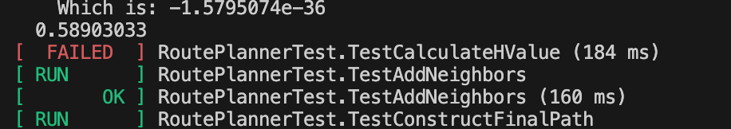

# OpenStreetMap Route Planner

This repo contains the starter code for the Route Planning project.

When the project is completed and successfully ran, a route-overlayed map will be saved to ```build/map_routed.png```


_Start: 10, 10 - End: 90, 90_

## Compiling and Running the Project
As you make changes to the source code, the build will **not** automatically update. To create updated executables, follow Steps 2 - 4. 

## Getting Started
This document contains instructions for how to run the project on your local machine. If you're using the Udacity-provided Workspace, these steps have already been completed.

### 1. Install Dependencies
> [!IMPORTANT]
> You'll need need superuser/admin privileges on your machine to install the dependencies.

Install the following dependencies:

* ```cmake >= 3.11.3```
  * All OSes: [click here for installation instructions](https://cmake.org/install/)
* ```make >= 4.1 (Linux, Mac), 3.81 (Windows)```
  * Linux: make is installed by default on most Linux distros
  * Mac: [install Xcode command line tools to get make](https://developer.apple.com/xcode/features/)
  * Windows: [Click here for installation instructions](http://gnuwin32.sourceforge.net/packages/make.htm)
* ```gcc/g++ >= 7.4.0```
  * Linux: gcc / g++ is installed by default on most Linux distros
  * Mac: same instructions as make - [install Xcode command line tools](https://developer.apple.com/xcode/features/)
  * Windows: recommend using [MinGW](http://www.mingw.org/)
* ```IO2D```
  * For ```Ubuntu >=22.04.5```, see below
  * **For other operating systems, [see here](https://github.com/cpp-io2d/P0267_RefImpl/blob/master/BUILDING.md)**. If you have trouble installing, refer to these supplemental guides:
    * [MacOS](https://github.com/mylescallan/OpenStreetMaps_C-/blob/master/README.md)
    * [Ubuntu < 22.04.05](https://github.com/dbecad/CppND-Route-Planning-Project/blob/master/Ubuntu16.4_Install.md#compile-io2d)
    * [Windows](https://knowledge.udacity.com/questions/42416)
  * **Instructions for installing on ```Ubuntu >=22.04.5```**:
```
git clone --recurse-submodules https://github.com/cpp-io2d/P0267_RefImpl
cd P0267_RefImpl
mkdir Debug
cmake -S .. -D CMAKE_BUILD_TYPE=Debug -DIO2D_WITHOUT_TESTS=1
cmake --build .. --config Debug
make
sudo make install
```

### 2. Compile
> [!NOTE]  
> Warning messages generated during this step can be ignored

Run the following commands from the root directory of the project (e.g., ```~/cpp-c1-Route-Planning-Project```). Two important executables will be created: ```test``` and ```OSM_A_star_search```. 
```
rm -rf build
mkdir build
cd build
cmake ..
make
```

After successfully compiling, your file tree should look like this:
```
cpp-c1-Route-Planning-Project
├── build/
│   ├── bin/
│   ├── CMakeFiles/
│   ├── lib/
│   ├── thirdparty/
│   ├── CMakeCache.txt
│   ├── cmake_install.cmake
│   ├── Makefile
│   ├── OSM_A_star_search
│   └── test
├── cmake/
├── lib/
├── src/
├── test/
├── thirdparty/
├── .gitignore
├── .gitmodules
├── CMakeLists.txt
├── map.osm
├── map.png
└── README.md
```

### 3. Test
> [!NOTE]
> If you can't run the executable, grant it the correct privelges by running ```chmod +x test``` from the ```build``` directory.

To ensure the program works as intentended, we need to first run unit tests. You can do this by running this command from the ```build``` directory:
```
./test
```

**Expected Results**
* **Incomplete project:** `RoutePlannerTest.TestCalculateHValue` will fail, and all other tests will pass.


* **Successfully completed project:** All tests will pass, as shown in the screenshot below (your terminal may or may not show color - either is fine)


#### Unit Tests Explained
#### 1. TestCalculateHValue
Tests the heuristic calculation function used in A* search.

**Purpose**: Verifies accurate distance estimation to the goal node.

**Test Cases**:
- Start node: Expected h-value = 1.1329799
- End node: Expected h-value = 0.0
- Middle node: Expected h-value = 0.58903033

**Importance**: Accurate heuristic values are essential for A* to find optimal paths.

#### 2. TestAddNeighbors
Tests the neighbor node expansion functionality. 

**Purpose**: Verifies correct processing of neighboring nodes.

**Test Cases**:
- Parent node assignments
- G-values (actual cost from start): [0.10671431, 0.082997195, 0.051776856, 0.055291083]
- H-values (heuristic values): [1.1828455, 1.0998145, 1.0858033, 1.1831238]
- Visited status verification

#### 3. TestConstructFinalPath
Tests the path reconstruction from end to start.

**Purpose**: Ensures correct path assembly after finding the goal.

**Test Cases**:
- Path length verification (3 nodes)
- Start node coordinate validation
- End node coordinate validation

#### 4. TestAStarSearch
> [!NOTE]
> Path size and distance values are specific to the provided map and start/end points.

Integration test for the complete A* search algorithm.

**Purpose**: Validates end-to-end pathfinding functionality.

**Test Cases**:
- Path size verification (33 nodes for this specific map)
- Start/end coordinate validation
- Total path distance (873.41565 units for this specific map)

### 4. Run
> [!NOTE]
> If you can't run the executable, grant it the correct privelges by running ```chmod +x OSM_A_star_search``` from the ```build``` directory.

After all unit tests have successfully ran, you can now run the program. From the ```build``` directory, run this command:
```
./OSM_A_star_search
```

By default, the program uses the ```map.osm``` map file. To specify a different map file, run:
```
./OSM_A_star_search -f ../<your_osm_file.osm>
```

If the program successfully executes, you'll see an output of: 
* The calculated distance
* A message that ```build/map_routed.png``` has been updated


> [!IMPORTANT]
> When your code is completed, each execution of ```./OSM_A_star_search``` will update the file ```map_routed.png```. Until you update your code, the program will say it's updated the map but that won't have actually happened.


## Project Instructions

_Instructions are listed in the Udacity course._

## Built With
* This code is based on [this map rendering example](https://github.com/cpp-io2d/P0267_RefImpl/tree/master/P0267_RefImpl/Samples/maps) from the IO2D implementation GitHub repo

### Core Dependencies
* [CMake](https://cmake.org/) (>= 3.11.3) - Cross-platform build system generator
* [gcc/g++](https://gcc.gnu.org/) (>= 7.4.0) - C/C++ compiler collection
* [make](https://www.gnu.org/software/make/) (>= 4.1 Linux/Mac, >= 3.81 Windows) - Build automation tool

### Libraries
* [IO2D](https://github.com/cpp-io2d/P0267_RefImpl) - 2D graphics library used for rendering the map and route
* [Cairo](https://www.cairographics.org/)- Graphics library providing the backend for IO2D
* [GraphicsMagick](http://www.graphicsmagick.org/) - Image processing library used for map manipulation
* [pugixml](https://pugixml.org/) (included in thirdparty/) - XML parser used for reading OpenStreetMap data
* [Google Test](https://github.com/google/googletest) (included in thirdparty/) - C++ testing framework for unit tests

### Development Files
* [libcairo2-dev](https://packages.debian.org/sid/libcairo2-dev) - Development files for Cairo graphics library
* [libgraphicsmagick1-dev](https://packages.debian.org/sid/libgraphicsmagick1-dev) - Development files for GraphicsMagick
* [libpng-dev](https://packages.debian.org/sid/libpng-dev) - PNG file format library for image handling
* [libxkbcommon-dev](https://packages.debian.org/sid/libxkbcommon-dev) - Keyboard handling library required by IO2D


## License

[License](LICENSE)
